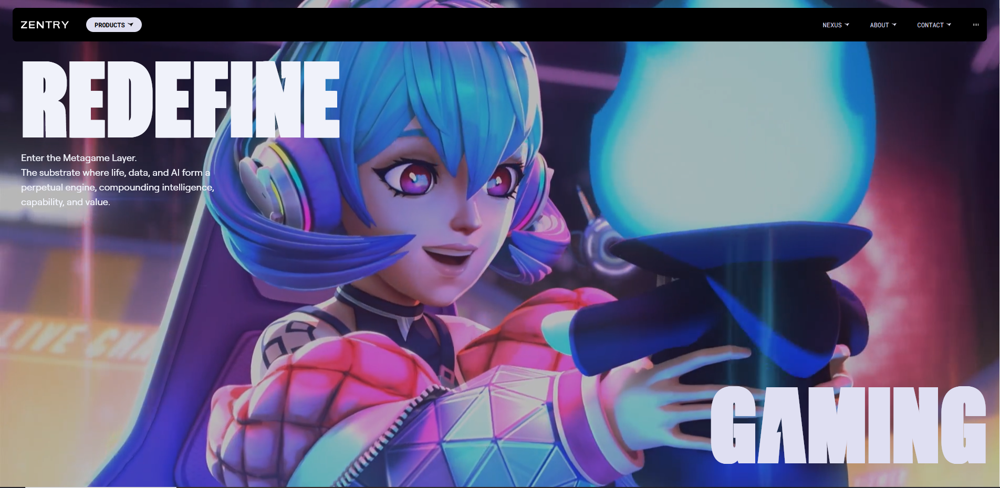
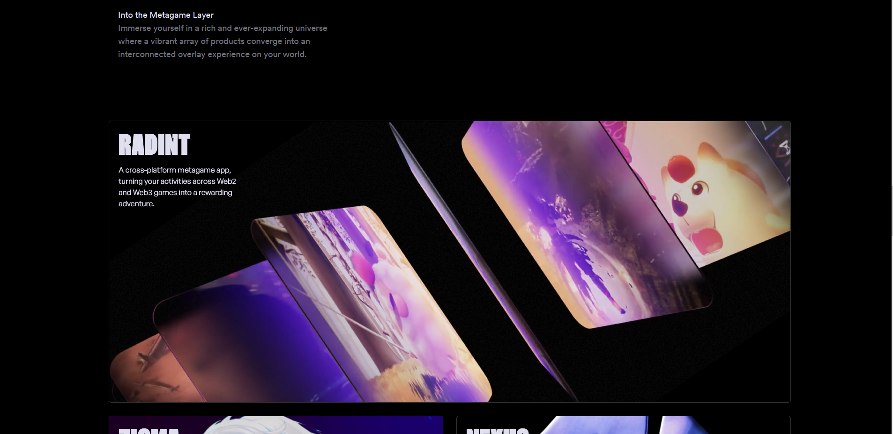
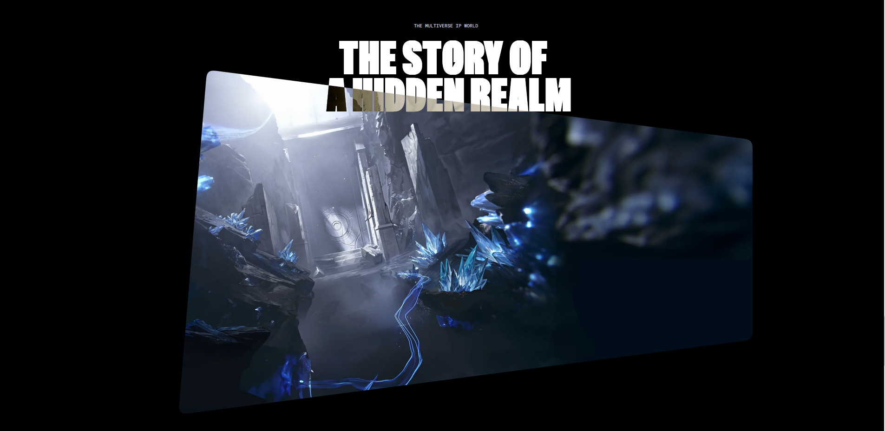
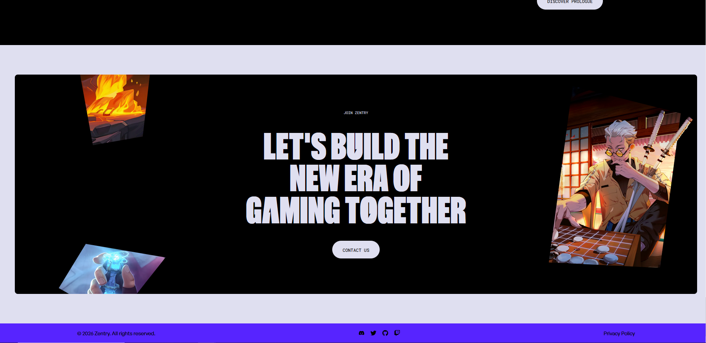

# Zentry - Award Winning Landing Page



An immersive, award-winning landing page clone of **Zentry**, built with **React**, **Tailwind CSS**, and **GSAP**. This project features cinematic video transitions, high-performance animations, and a sophisticated HUD navigation system.

## 🚀 Experience the Metagame

- **Cinematic Video HUD**: Interactive video transitions using GSAP and clip-paths.
- **Bento-Grid Layout**: A modern, responsive feature section with tilt-on-hover effects.
- **Floating HUD Navigation**: A smart navbar that responds to scroll direction and includes a real-time audio visualizer.
- **Zentry Icon System**: Custom-coded SVG icons and wordmark for pixel-perfect rendering.
- **Responsive Animations**: GSAP ScrollTrigger timelines optimized for all devices.

## 🛠️ Tech Stack

- **Framework**: [React.js](https://reactjs.org/)
- **Build Tool**: [Vite](https://vitejs.dev/)
- **Animations**: [GSAP](https://greensock.com/gsap/) (ScrollTrigger, Flip), [Framer Motion](https://www.framer.com/motion/)
- **Styling**: [Tailwind CSS](https://tailwindcss.com/)
- **Hooks**: [React-use](https://github.com/streamich/react-use)

## 📸 Project Previews

|                            Hero Section                             |                                Features (Bento)                                 |
| :-----------------------------------------------------------------: | :-----------------------------------------------------------------------------: |
| [](public/screenshots/hero.png) | [](public/screenshots/features.png) |

|                             Story Section                              |                               Contact & Footer                               |
| :--------------------------------------------------------------------: | :--------------------------------------------------------------------------: |
| [](public/screenshots/story.png) | [](public/screenshots/footer.png) |

## ⚙️ Getting Started

### Prerequisites

- [Node.js](https://nodejs.org/) (v18 or higher)
- [npm](https://www.npmjs.com/) or [yarn](https://yarnpkg.com/)

### Installation

1. Clone the repository:

   ```bash
   git clone https://github.com/WhiiteRose/Zentry.git
   ```

2. Navigate to the project directory:

   ```bash
   cd Zentry
   ```

3. Install dependencies:
   ```bash
   npm install
   ```

### Execution

To launch the development server:

```bash
npm run dev
```

The site will be available at `http://localhost:5173`.

## 📂 Project Structure

- [**Hero Section**](src/components/Hero.jsx) - Interactive video HUD
- [**Navigation Bar**](src/components/NavBar.jsx) - Floating menu with audio HUD
- [**Features Hub**](src/components/Features.jsx) - Bento grid layout
- [**Story Component**](src/components/Story.jsx) - Clip-path animations
- [**Contact & Footer**](src/components/Contact.jsx) - Global contact section
- [**Icon System**](src/components/icons/index.js) - Custom SVG icons

---

Built with ❤️ by [WhiiteRose](https://github.com/WhiiteRose)
